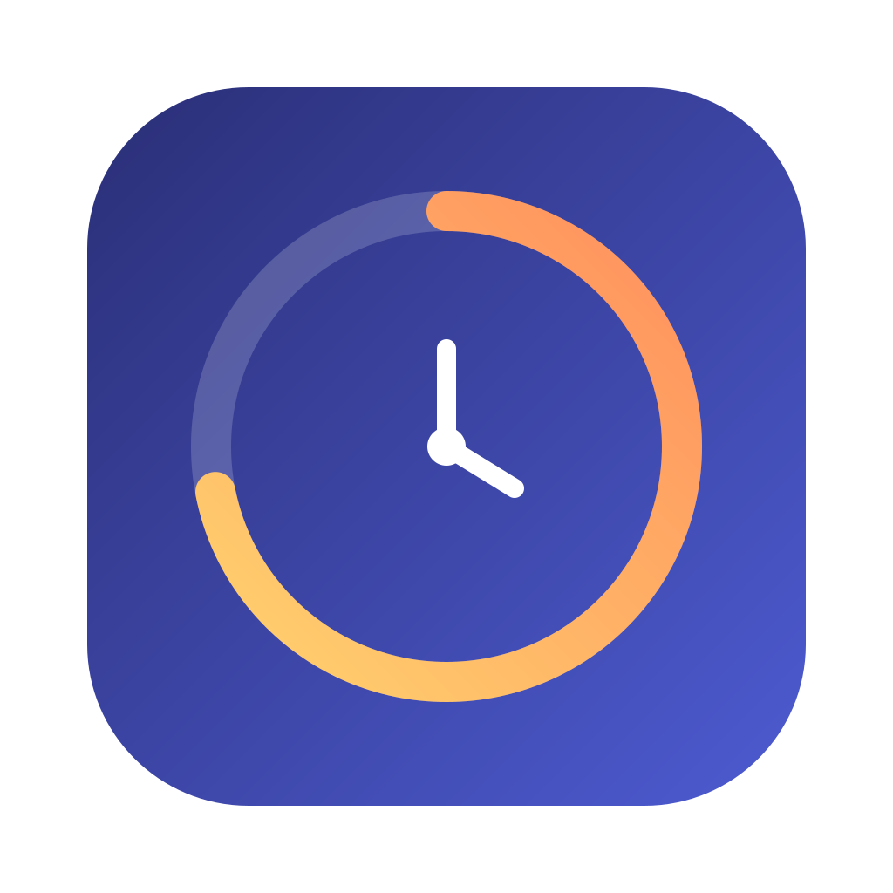

<div align="center">
  
  <h1>AI Usage Widget</h1>
  <p>A private, always-visible usage monitor for your local AI subscriptions.</p>
  <p>
    <a href="https://github.com/TruongAn0209/ai-usage-widget/actions/workflows/ci.yml"></a>
    <a href="https://github.com/TruongAn0209/ai-usage-widget/releases/latest"></a>
    <a href="LICENSE"></a>
    
  </p>
  <p>
    <a href="https://truongan0209.github.io/ai-usage-widget/"><strong>Product page</strong></a>
    · <a href="https://github.com/TruongAn0209/ai-usage-widget/releases/latest">Download</a>
    · <a href="SECURITY.md">Security</a>
    · <a href="PRIVACY.md">Privacy</a>
  </p>
</div>

---

AI Usage Widget stays above your work and shows usage windows, reset times, local session context
and today’s activity without a separate account or analytics backend. It detects supported AI
tools already signed in on your computer.

> Community project. Not affiliated with Anthropic, OpenAI, Google, xAI or OpenRouter.

## Highlights

- Windows 10/11 and macOS 12+.
- Claude, GPT Plus/Codex, Antigravity, Grok and OpenRouter; Gemini is also available on Windows.
- Claude CLI and Claude Desktop/IDE discovery, including the IDE usage fallback.
- Five layouts, multiple palettes, opacity, screen position and always-on-top controls.
- Usage warnings, reset countdowns and a local session/context view.
- No telemetry, advertising, analytics account or intermediary server.
- Credentials stay in the main process and are sent only to their issuing provider.

## Platform support

| Provider | Windows | macOS | Local source |
|---|:---:|:---:|---|
| Claude Code + Desktop/IDE | ✓ | ✓ | Claude credential store, transcripts and IDE usage history |
| GPT Plus / Codex | ✓ | ✓ | `~/.codex/auth.json` |
| Antigravity | ✓ | ✓ | Local `agy` process over loopback |
| Grok | ✓ | ✓ | Grok CLI credential store |
| OpenRouter | ✓ | ✓ | Environment or dedicated local config |
| Gemini | ✓ | — | Gemini CLI credential store |

Provider usage endpoints are not guaranteed public APIs and may change. A provider failure is
isolated and shown without breaking the rest of the widget.

## Install

Download the latest files from [GitHub Releases](https://github.com/TruongAn0209/ai-usage-widget/releases/latest):

- **Windows x64:** run the `Windows-x64-Setup.exe` installer.
- **Apple Silicon:** open the `macOS-arm64.dmg`.
- **Intel Mac:** open the `macOS-x64.dmg`.

Current community builds are unsigned. Windows SmartScreen or macOS Gatekeeper may therefore ask
for confirmation. See the release notes before continuing. Signed and notarized distribution is
tracked separately.

## Repository layout

```text
apps/
  macos/      Electron app and macOS-specific credential/process integration
  windows/    Electron app and Windows-specific credential/process integration
site/         GitHub Pages product and download page
.github/      CI, Pages deployment, dependency updates and tagged releases
```

## Development

Node.js 22 is recommended.

```bash
# macOS
cd apps/macos
npm ci
npm test
npm start

# Windows (PowerShell)
cd apps/windows
npm ci
npm test
npm start
```

Build commands:

```bash
# Run on macOS; produces Intel and Apple Silicon DMGs
cd apps/macos && bash build-mac.sh

# Run on Windows; produces the x64 installer
cd apps/windows && npm run dist:win
```

Every pull request runs the public-safety scan and platform tests. Version tags matching `v*`
build both platforms and publish a GitHub Release.

## Trust and privacy

Read [PRIVACY.md](PRIVACY.md) for every local file and network destination used by the app.
Please report vulnerabilities privately using [SECURITY.md](SECURITY.md), and never attach real
credential files or tokens to an issue.

## Contributing

Bug reports and focused pull requests are welcome. Start with [CONTRIBUTING.md](CONTRIBUTING.md).

Released under the [MIT License](LICENSE).
